# Assignment 4: Complete CI/CD Pipeline with Testing & Deployment

- The current project implements a full-fledged DevOps CI/CD pipeline that consists of three stages: Build, Test, and Deployment. The application deployed on Render is a Task Manager API implemented using Flask.

### Live Application : https://assignment-4-dso.onrender.com/
### Github Link: https://github.com/choden12/Assignment_4_DSO.git

## Project Structure 
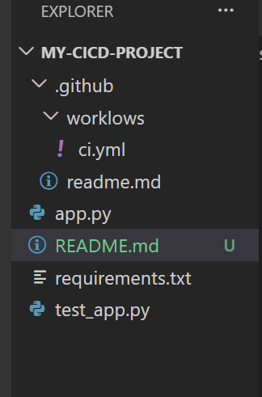

## Tools and Technologies
- Python 
- Flask
- Pytest
- gunicorn
- GitHub Actions
- Render
- Git 

## Step1
- Firstly, the folder and the files are created in the root folder. This project is well organized using three main files; the main application file named app.py, the testing file named test_app.py, and the dependency file named requirements.txt.

## Step2: Develop the Flask Application
- Task Manager API was created with four RESTful endpoints, which perform the basic functions of the program. These include the home endpoint, which will confirm whether the service is running; the GET endpoint, which will allow one to fetch all tasks; the POST endpoint, which will enable users to create tasks; and finally the DELETE endpoint, which will be used to delete tasks by their IDs.
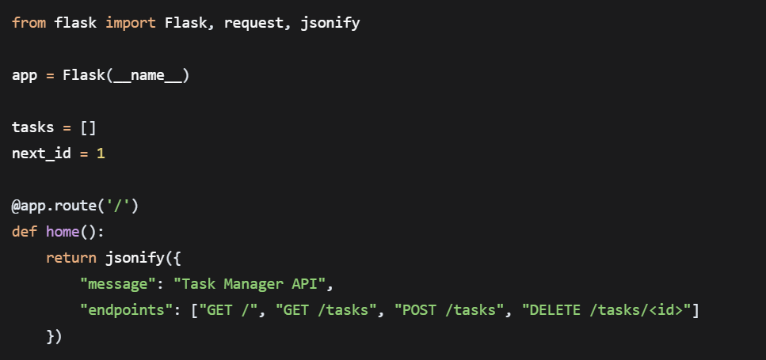

## Step3: Write Unit Tests
- The unit tests were conducted by using the pytest framework to guarantee that the reliability of the API is maintained. There were seven tests carried out in order to check for all the features of the API that include both successful and erroneous instances. Some of the API routes checked during the tests include the home route, fetching tasks, adding tasks, and deleting tasks. Furthermore, there are also some tests to ensure that an error occurs when performing erroneous actions like adding a task without a name or removing a non-existent task. There was also a basic test to ensure that the testing framework works perfectly.
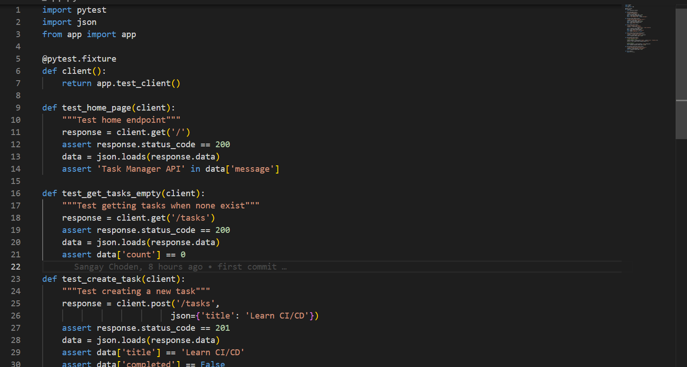
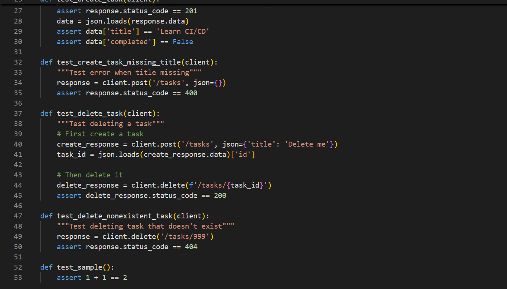

## Step4: Create requirements.txt
- The requirements.txt file contains all the necessary Python packages for running the application and tests.
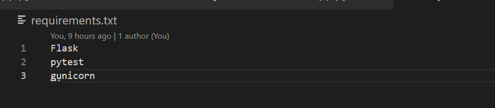

## Step 5: Set Up CI/CD Pipeline with GitHub Actions
- CI/CD pipeline is described in .github/workflows/ci.yml and is triggered automatically for each push in the main branch.
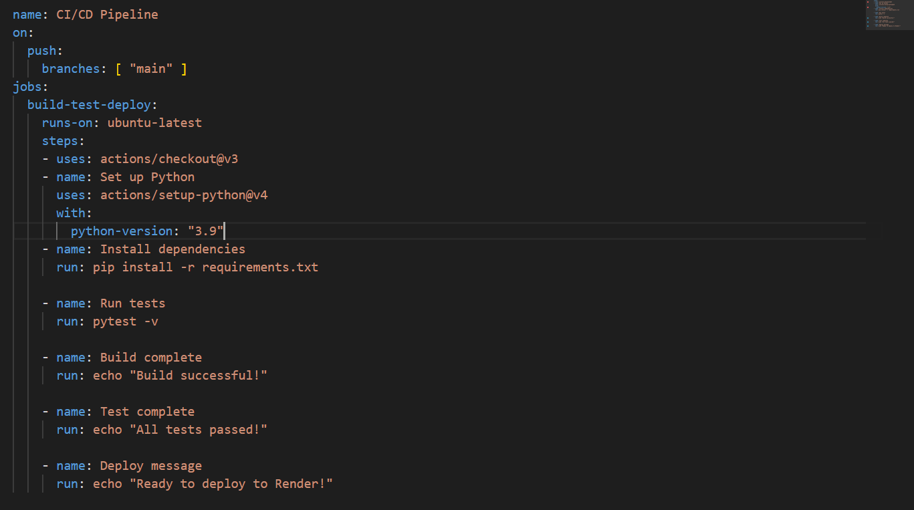

## Step 6: Push Code to GitHub
- All code was pushed to GitHub using the following Git commands:
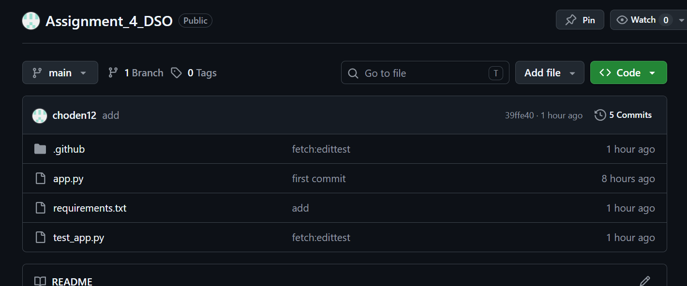

## Step 7: Deploy to Render
- The application was hosted on Render using the following setup:
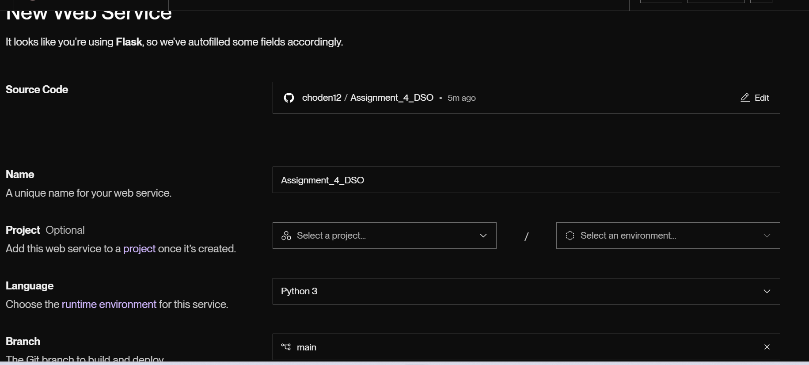
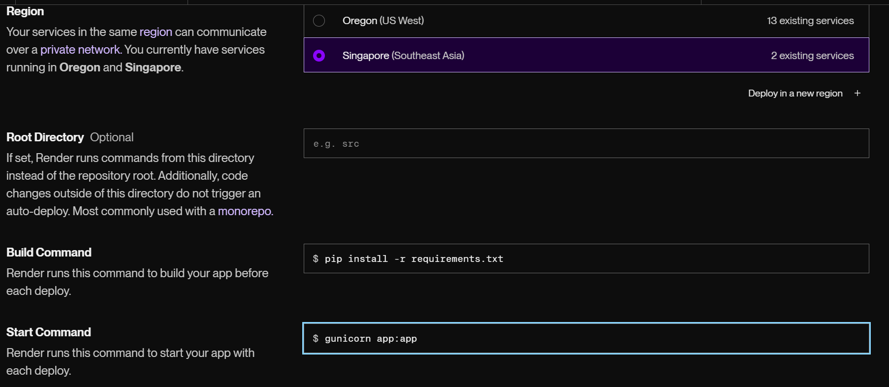

## Step 8: Verify Live Application
- The live application was tested using curl commands:
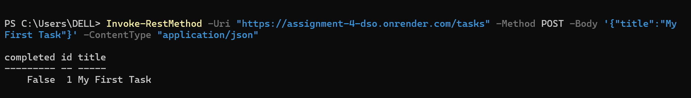
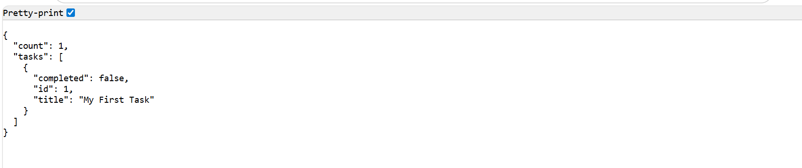

## Challenge
There were quite a few issues I encountered during the process of developing a full CI/CD pipeline for the Task Manager API:
### Project Structure Organization
- Issue: Initially, I did not know how to properly organize my files. I was not sure where to locate app.py, test_app.py, and .github/workflows/ directory.
- Solution: I researched examples on the internet and chose to store all of my files in the root directory. I manually constructed the directory tree in .github/workflows/ to store ci.yml.

## Making GitHub Actions Work Correctly
- What the problem was: When pushing my code for the first time to GitHub, Actions did not run successfully. I could not understand the errors shown because I could not find out why Python was unable to import Flask.

- What helped me solve the problem: I found out that I omitted the installation of Flask and pytest in my requirements.txt file. After installing all the needed packages and pushing once more, everything started working smoothly.

## Conclusion
-In summary, this assignment was instrumental in enabling me to create an end-to-end CI/CD pipeline for a Task Manager API, created using Flask, pytest, GitHub Actions, and Render. In this process, I created an API with four different endpoints, created seven unit tests for checking its correct functioning, used GitHub actions for automatic running of tests with every push, and finally, made the deployment live at https://assignment-4-dso.onrender.com/. While doing this assignment, many lessons have been learned regarding test isolation, error handling, platform-specific deployment settings, and using the Git workflow. All of this culminated in a completely automated CI/CD pipeline in which each push is tested and then deployed, thus giving hands-on experience of actual DevOps.

